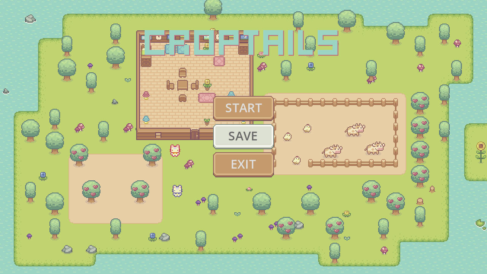
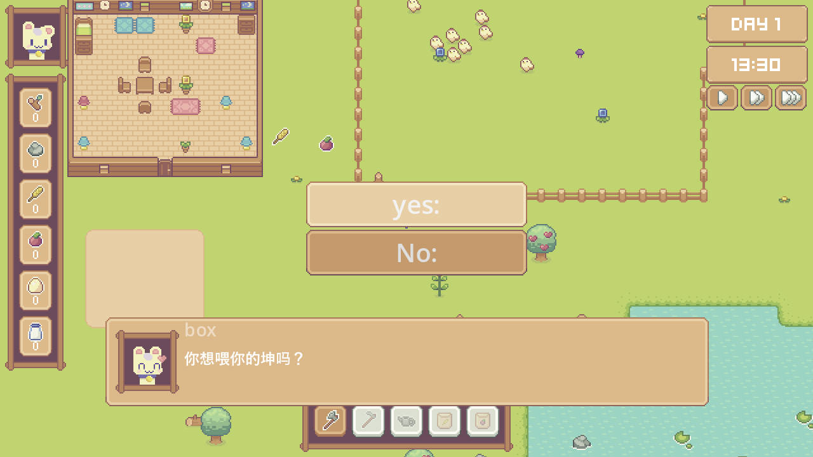

# Croptails

## Overview

Croptails is a cozy farming game prototype and a record of my indie game development practice.

It is based on a very solid Godot 4.3 course: [YouTube](https://www.youtube.com/watch?v=it0lsREGdmc&t=3s), [BiliBili](https://www.bilibili.com/video/BV1YhSXYTE51?p=25&vd_source=a49e175e84c42d23d87a620add615b1d)

What you can learn here:

1. A custom state machine implementation
2. Reusable components
3. NPC dialogue systems
4. Time systems
5. Inventory systems
6. Planting systems
7. Save systems
8. Navigation and pathfinding

The 9-hour course covers a lot of useful techniques and builds a complete farming prototype, but it still contains bugs you will need to solve yourself while learning the code.

## Main Menu

## NPC Dialogue

